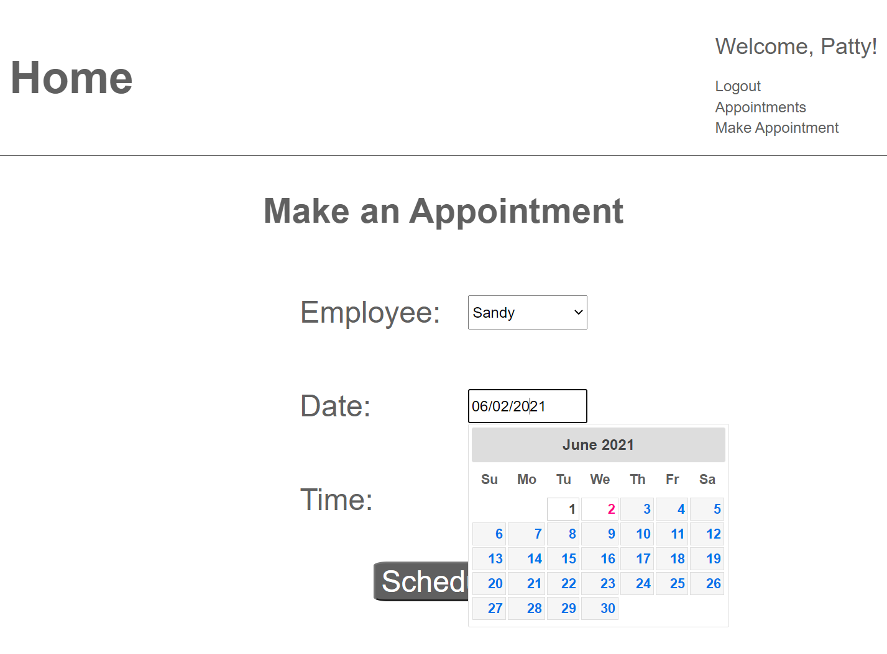
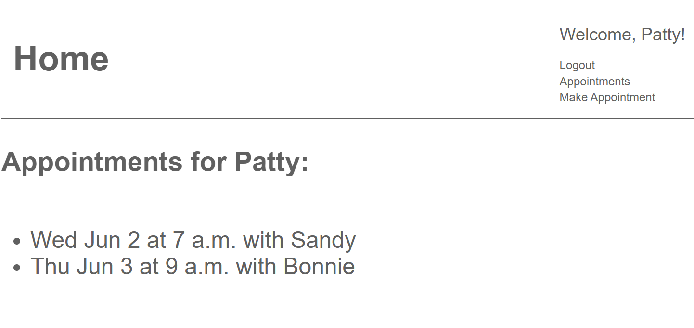

# Appointments-Django

## Python Version 3.9.5

### REST API using Django Rest Framework. 
This project will be used as the boilerplate for a custom appointments web app for a nail salon in Denver, Colorado.

The appointment_api and appointment_website are seperate apps but share a python environment in the top level of the project. To create
a python environment, navigate to top directory in the project:
```
python -m venv venv
```
Then to activate the environment in Windows CMD:
```
venv\venv\activate.bat
```
or on Linux or Mac:
```
venv/venv/activate
```


To start the api:
```
cd appointment_api
python manage.py migrate
python manage.py makemigrations api
python manage.py createsuperuser
python manage.py runserver 8080
```

Token authentication is used, so users must have a token to be able to access the api. Tokens can be generated via command-line:
```
python manage.py drf_create_token username
```

There are 3 types of users:
1. admin
    - has permissions for everything
2. manager
    - can add new Users (managers) with is_staff=True access
    - can add new Employees, Customers, and Appointments 
    - otherwise same access as api_user but can see more detail for employees and customers
3. api_user
    - can add Customers and Appointments

### Django Website Front-End
Django website that connects to the appointments API and lets users view and make appointments.
To start the website:
```
cd appointment_website
python manage.py migrate
python manage.py runserver 8000
```
Once up and running you can create some users and make appointments:

